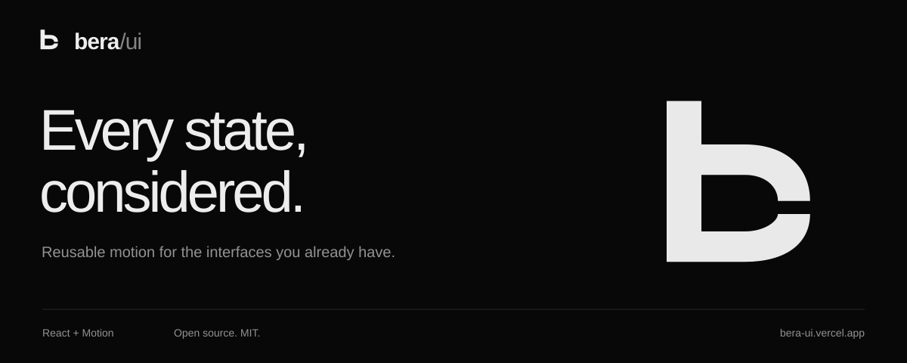
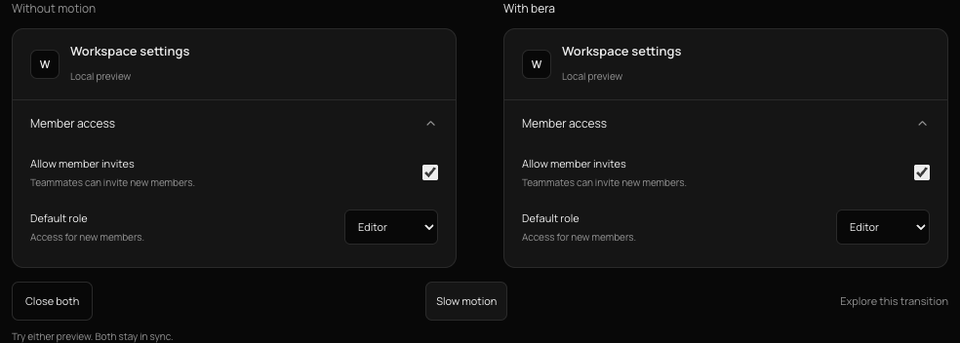

<a href="https://bera-ui.vercel.app">
  
</a>

<p align="center">
  Reusable motion for the interfaces you already have.
</p>

<p align="center">
  <a href="https://bera-ui.vercel.app"><strong>Explore the collection</strong></a>
  ·
  <a href="https://bera-ui.vercel.app/agents">Agent guide</a>
  ·
  <a href="CONTRIBUTING.md">Contribute</a>
  ·
  <a href="LICENSE">MIT</a>
</p>

<p align="center">
  <a href="https://github.com/elberacasa/bera-ui/actions/workflows/ci.yml">
    
  </a>
</p>

## The detail is in the transition.

bera/ui is a motion library for React. Explore an interaction, adjust its feel, and bring the source into your product. Each recipe includes the component, its styles, and the guidance your coding agent needs to adapt it.

<a href="https://bera-ui.vercel.app/#compare-accordion">
  <picture>
    <source media="(prefers-reduced-motion: reduce)" srcset="assets/comparison.png" />
    
  </picture>
</a>

The same interface and shared state, using the [accordion recipe](https://bera-ui.vercel.app/#accordion). This recording used **0.4× slow playback**; [try the current comparison at normal speed](https://bera-ui.vercel.app/#compare-accordion).

## See what changes

Six live comparisons share the same content, styling, and application state on both sides. Their resting states match: use the action beside each example to see what motion changes. Jump directly to a pattern or inspect it with **0.35× slow playback**. On mobile, choose **Without bera** or **With bera**, then repeat the same action.

| Comparison                                                                | Use case                    | Without Bera                            | With Bera                                                     |
| ------------------------------------------------------------------------- | --------------------------- | --------------------------------------- | ------------------------------------------------------------- |
| [Sliding tabs](https://bera-ui.vercel.app/#compare-sliding-tabs)          | Filter project files        | Selection switches instantly.           | The active indicator travels between tabs as content changes. |
| [Accordion](https://bera-ui.vercel.app/#compare-accordion)                | Reveal workspace settings   | Content appears at its final height.    | The section opens and closes to its content height.           |
| [Expanding search](https://bera-ui.vercel.app/#compare-expanding-search)  | Find a component            | The button becomes a field immediately. | The field grows from the button, then reveals its controls.   |
| [Rolling counter](https://bera-ui.vercel.app/#compare-rolling-counter)    | Adjust team seats           | Digits change instantly.                | Changed digits roll in the direction of the adjustment.       |
| [Morphing icon](https://bera-ui.vercel.app/#compare-morphing-icon-button) | Toggle workspace navigation | Menu and close shapes switch instantly. | The same SVG strokes reshape into the next icon.              |
| [Text swap](https://bera-ui.vercel.app/#compare-text-swap)                | Preview review statuses     | The status text changes instantly.      | Words and their icon move through a sequenced handoff.        |

- **Try it.** Interactive previews, replay, and slow playback reveal how each transition works.
- **Tune it.** Adjust timing and shape, then carry your settings into the integration.
- **Make it yours.** Keep your components, content, design tokens, and application state.
- **Keep the source.** Copy a single React export and its CSS. Edit them in your own project.

## Refine an existing interface

Run this from your application directory:

```sh
npx skills add elberacasa/bera-ui --skill bera-motion
```

Choose your coding agent when prompted. The skill includes the catalog, complete source, and integration recipes. Your agent can bring a transition into an existing Radix, shadcn, or custom component while retaining its state, actions, and accessibility behavior.

For one interaction, open the [collection](https://bera-ui.vercel.app), customize a preview, and choose **Copy for agent**. The copied brief includes the source and your selected settings.

<details>
<summary><strong>Bring motion to an existing Radix menu</strong></summary>

```sh
npx shadcn@latest add https://bera-ui.vercel.app/r/radix-menu-motion.json
```

Import the installed CSS and add `data-bera-menu-motion` to your existing `DropdownMenuContent` and `DropdownMenuSubContent`. The adapter adds no dependencies and keeps your menu's state, commands, styling, and keyboard behavior. Remove only conflicting enter/exit animation utilities from the opted-in content.

[Try the live integration](https://bera-ui.vercel.app/integrations/radix-menu) or follow the [host diff and integration guide](skills/bera-motion/references/radix-menu-motion.md). Entry uses modern `@starting-style`; older browsers get immediate entry. Reduced motion and Radix's native exit lifecycle are preserved.

</details>

## Add a standalone component

From a React project with shadcn configured:

```sh
npx shadcn@latest add https://bera-ui.vercel.app/r/copy-button.json
```

The registry adds the component and its CSS under your configured components directory's `bera/` folder, with its Motion and icon dependencies. It supplies no global theme overrides or replacement shadcn primitives.

```tsx
import { CopyButton } from "@/components/bera/copy-button";

<CopyButton text="npm install motion" speed={1.15} radius={8} />;
```

Adjust the import to your project's alias. Registry installs use the original recipe; pass your chosen gallery settings as props afterward. Connect application data and callbacks, and leave `preview` off.

Recipes use complete CSS color values, as in current Tailwind v4/shadcn themes. Older themes with raw HSL channels need a small mapping in the copied recipe's styles. See the [integration guide](skills/bera-motion/references/integration.md#host-styles) for the boundary.

<details>
<summary><strong>Use the registry with your agent</strong></summary>

Merge this entry into the `registries` object in your existing `components.json`:

```json
{
  "registries": {
    "@bera": "https://bera-ui.vercel.app/r/{name}.json"
  }
}
```

Then use `npx shadcn@latest add @bera/copy-button`. With the [shadcn MCP server](https://ui.shadcn.com/docs/mcp) configured in your coding agent, the same registry supports browsing, search, and installation. The Bera skill supplies the motion and adaptation guidance.

The [agent guide](https://bera-ui.vercel.app/agents#registry), [machine-readable catalog](https://bera-ui.vercel.app/transitions/manifest.json), and [llms.txt index](https://bera-ui.vercel.app/llms.txt) provide direct entry points.

</details>

<details>
<summary><strong>Install without shadcn</strong></summary>

Download the [portable kit](https://bera-ui.vercel.app/bera-motion.tar.gz) and extract it into your project root. Then install a selected transition:

```sh
node bera-motion/install.mjs add copy-button --project .
```

This creates `components/bera/copy-button.tsx` and its CSS. The installer reports missing dependencies; add them with your project's package manager. It requires Node.js 18 or newer, supports `--dry-run`, and preserves differing destination files.

See the [agent guide](https://bera-ui.vercel.app/agents) for the complete local workflow and each recipe's integration notes.

</details>

## Develop

Use Node.js **22.x, version 22.13 or newer**.

```sh
npm ci
npm run dev
```

Open [localhost:5173](http://localhost:5173). Read the [contribution guide](CONTRIBUTING.md) for source generation, checks, and the pull request workflow. GitHub Actions validates changes; Vercel provides previews and the production gallery.

## Contribute

Refine an interaction, improve an integration, or propose a useful new pattern. Start with the [roadmap](docs/ROADMAP.md) and [open issues](https://github.com/elberacasa/bera-ui/issues).

## License

[MIT](LICENSE). Use and adapt the source in personal or commercial projects. Dependencies and the bundled [Manrope font](public/fonts/OFL.txt) retain their respective licenses.
